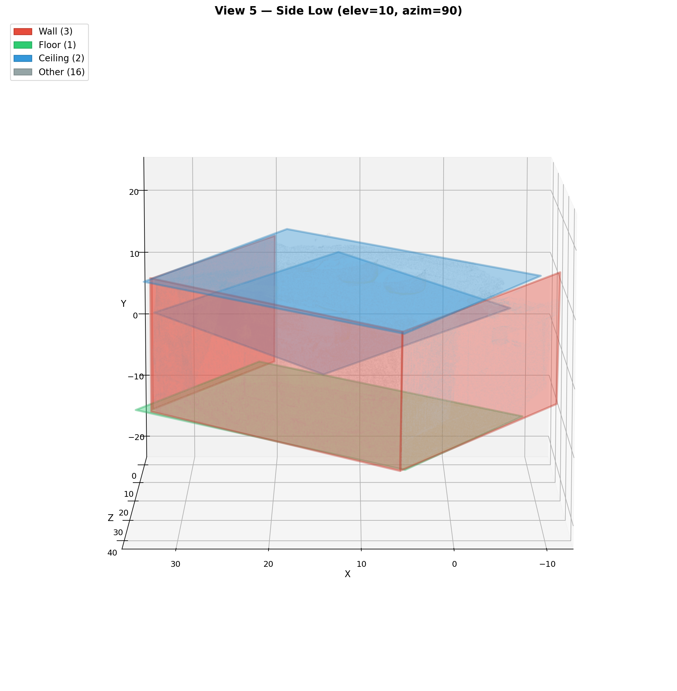
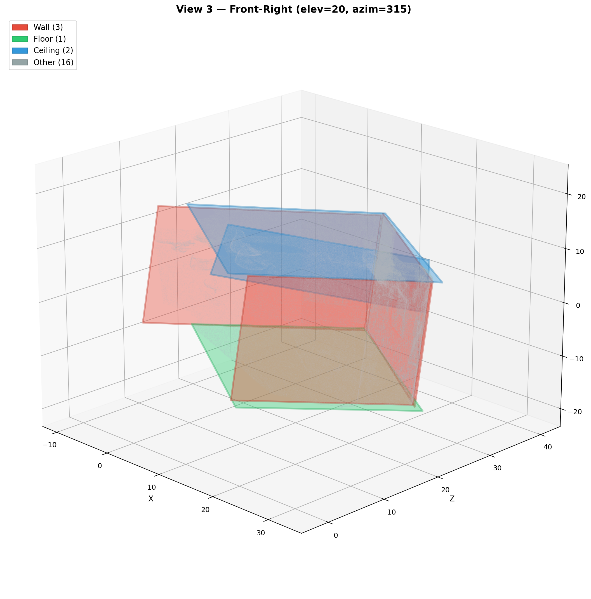
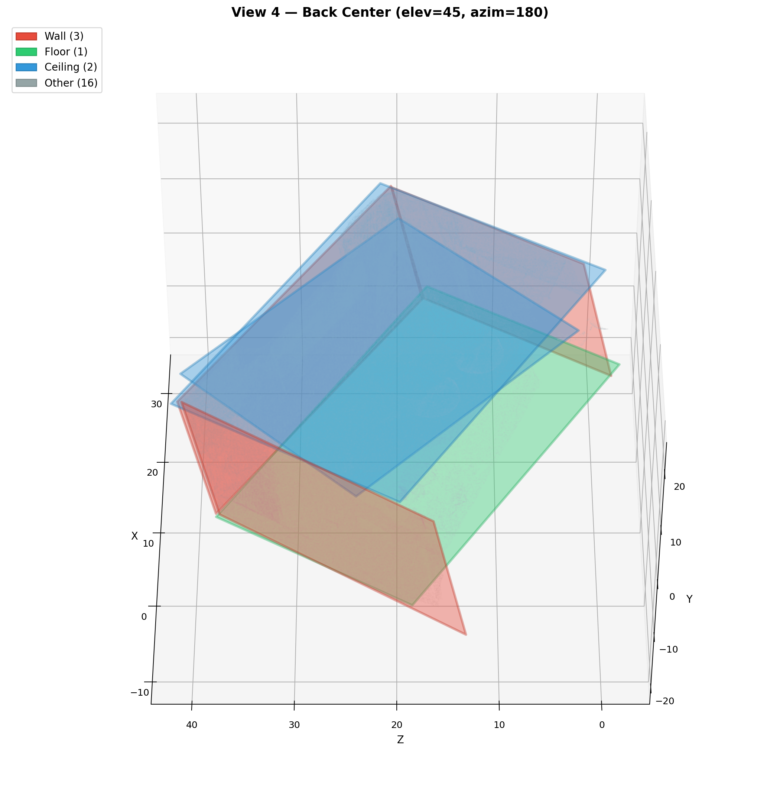
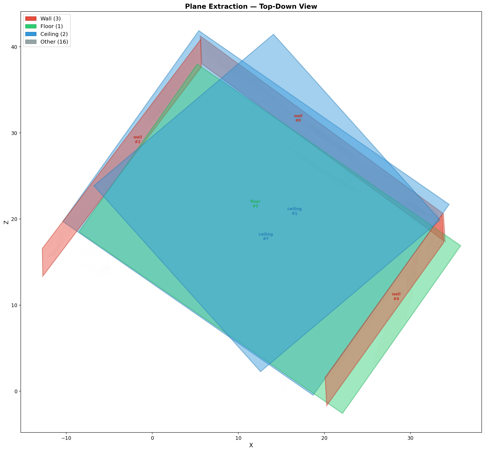
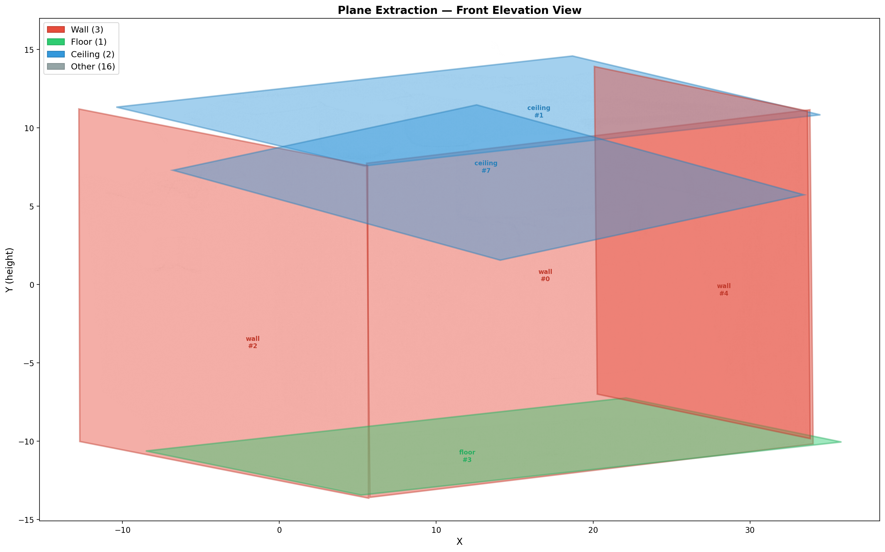

# GSS — 3DGS to BIM Pipeline

Video → 3D Gaussian Splatting → Surface Reconstruction → BIM (IFC) 자동 변환 파이프라인.

## Two Pipelines

### 기존 (8-step)
```
s01 → s02 → s03(gsplat) → s04(depth) → s05(TSDF) → s06 → s06b → s07
```
Config: `configs/pipeline.yaml`

### PlanarGS (6-step, 권장)
```
s01 → s02 → s03_planargs(PlanarGS) → s06 → s06b → s07
```
Config: `configs/pipeline_planargs.yaml`

## Pipeline Steps

| # | Step | Description | Pipeline |
|---|------|-------------|----------|
| s01 | extract_frames | 비디오에서 프레임 추출 (OpenCV) | both |
| s02 | colmap | SfM 카메라 포즈 추정 (pycolmap) | both |
| s03 | gaussian_splatting | 2DGS 학습 (gsplat) | 기존 |
| s03_planargs | planargs | PlanarGS subprocess (NeurIPS 2025) | PlanarGS |
| s04 | depth_render | Depth/Normal 맵 렌더링 (gsplat) | 기존 |
| s05 | tsdf_fusion | TSDF 볼륨 통합 (Open3D) | 기존 |
| s06 | plane_extraction | 평면 추출 + Manhattan 정렬 + 병합 + 경계 | both |
| s06b | plane_regularization | 평면 정규화 (normal snap, height snap, wall thickness, corner trim, space detection) | both |
| s07 | ifc_export | IFC4 BIM 파일 생성 (IfcOpenShell) | both |

## Quick Start

```bash
pip install -e .
gss info                                        # Show pipeline steps
gss run                                         # Run 기존 pipeline
gss run --config configs/pipeline_planargs.yaml  # Run PlanarGS pipeline
gss run-step plane_extraction                    # Run single step
```

## E2E Test Results (Replica room0)

| Metric | PlanarGS |
|--------|----------|
| Surface points | 21.4M |
| PSNR | 40.13 |
| Walls detected | 3 |
| Floors detected | 1 |
| Ceilings detected | 2 |
| Other (furniture) | 16 |
| s06 time | ~100s |
| Total time | ~45min |

### Plane Extraction Visualization

| View | Image |
|------|-------|
| Isometric (Side Low) |  |
| Front-Right |  |
| Back Center |  |
| Top-Down |  |
| Front Elevation |  |

Wall(빨강) 3개가 ㄷ자로 방을 감싸고, Floor(초록) 바닥, Ceiling(파랑) 천장이 분리 검출됨.
전면 벽은 카메라 시점 위치로 미검출 (정상).

## Tech Stack

| Phase | Tool | Package |
|-------|------|---------|
| SfM | COLMAP | pycolmap |
| 3DGS (기존) | gsplat 2DGS | gsplat |
| 3DGS (PlanarGS) | PlanarGS subprocess | diff-plane-rasterization |
| TSDF | Open3D ScalableTSDFVolume | open3d |
| Planes | RANSAC + Manhattan + coplanar merge | open3d, shapely |
| BIM | IfcOpenShell | ifcopenshell |

## s06 Plane Extraction Features

- **Manhattan World Alignment**: normal histogram → auto axis detection → axis-aligned RANSAC
- **Coplanar Merging**: Union-Find + centroid separation → SVD refit
- **Position-based Classification**: horizontal planes → floor/ceiling/furniture by height
- **Architectural Filtering**: small walls/ceilings (< 10% of max) → reclassified as furniture
- **Clean Boundaries**: minimum_rotated_rectangle for wall/floor/ceiling (5-vertex rectangles)

## s06b Plane Regularization Features

s06 RANSAC 결과를 BIM에 맞게 정리하는 geometric cleanup step.

- **A. Normal Snapping**: wall normals → 정확한 ±X/±Z 축, floor/ceiling → ±Y (Manhattan space)
- **B. Height Snapping**: floor/ceiling 높이를 cluster mean으로 통일
- **C. Wall Thickness**: parallel wall pair 감지 → thickness + center-line 계산
- **D. Intersection Trimming**: wall endpoint를 corner intersection으로 연장 (scale-aware)
- **E. Space Detection**: wall center-lines → Shapely polygonize → room boundary polygons
- **F. Opening Detection**: Phase 2 (disabled)

## References

각 단계별 핵심 참고 논문. 전체 목록은 [`docs/research_papers.md`](docs/research_papers.md) 참조.

| 단계 | 논문 | 게재 | 역할 |
|------|------|------|------|
| 3DGS 기초 | [3D Gaussian Splatting](https://arxiv.org/abs/2308.04079) (Kerbl et al.) | SIGGRAPH 2023 | 3DGS 원본 |
| Surface (기존) | [2D Gaussian Splatting](https://arxiv.org/abs/2403.17888) (Huang et al.) | SIGGRAPH 2024 | 2DGS surfel 기반 surface reconstruction |
| Surface (PlanarGS) | [PlanarGS](https://arxiv.org/abs/2510.23930) | NeurIPS 2025 | GroundedSAM + co-planarity loss, Replica Chamfer 2.5x 개선 |
| 라이브러리 | [gsplat](https://arxiv.org/abs/2409.06765) (Ye et al.) | JMLR MLOSS | 2DGS 모드 내장 렌더링 라이브러리 |
| 실내 특화 | [2DGS-Room](https://arxiv.org/abs/2412.03428) (Zhang et al.) | 2024 | textureless 벽/바닥 대응, seed-guided init |
| 평면 정규화 | [PGSR](https://arxiv.org/abs/2406.06521) (Chen et al.) | IEEE TVCG | planar prior regularization |
| Plane→BIM | [Cloud2BIM](https://arxiv.org/abs/2503.11498) (Zbirovský, Nežerka) | Automation in Construction 2025 | RANSAC→boundary→IFC 파이프라인 검증 |
| Coplanar Merge | [VERTICAL](https://arxiv.org/abs/2508.07355) | ISPRS 2025 | coplanar face 병합 + 비정규 경계 정리 |
| Manhattan Alignment | Furukawa et al. — Manhattan World Stereo | ECCV 2016 | normal SVD → dominant axis → axis-aligned reconstruction |
| Plane Simplification | [Structure-preserving Planar Simplification](https://arxiv.org/abs/2408.06814) | 2024 | centroid separation 기반 coplanarity 판정 |

## Project Structure

```
src/gss/core/          - Pipeline runner, BaseStep ABC
src/gss/steps/s01~s07/ - Each step: step.py + config.py + contracts.py + README.md
src/gss/steps/s03_planargs/ - PlanarGS wrapper (replaces s03+s04+s05)
src/gss/steps/s06b_plane_regularization/ - Geometric cleanup (6 sub-modules)
configs/               - YAML configs (pipeline.yaml, pipeline_planargs.yaml)
data/                  - raw/ → interim/s01~s06/ → processed/
clone/PlanarGS/        - PlanarGS repo (separate conda env)
docs/                  - Research papers, images
```
