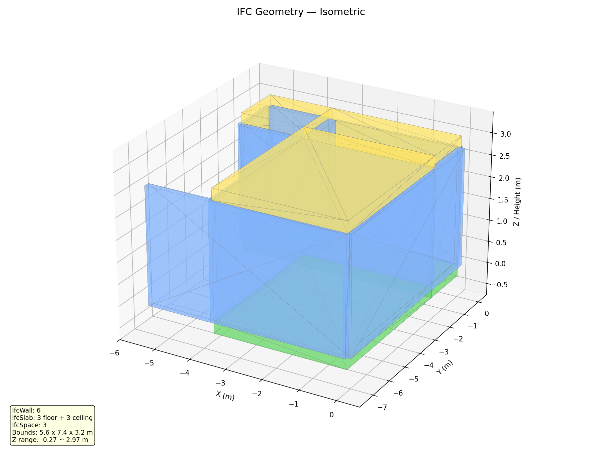
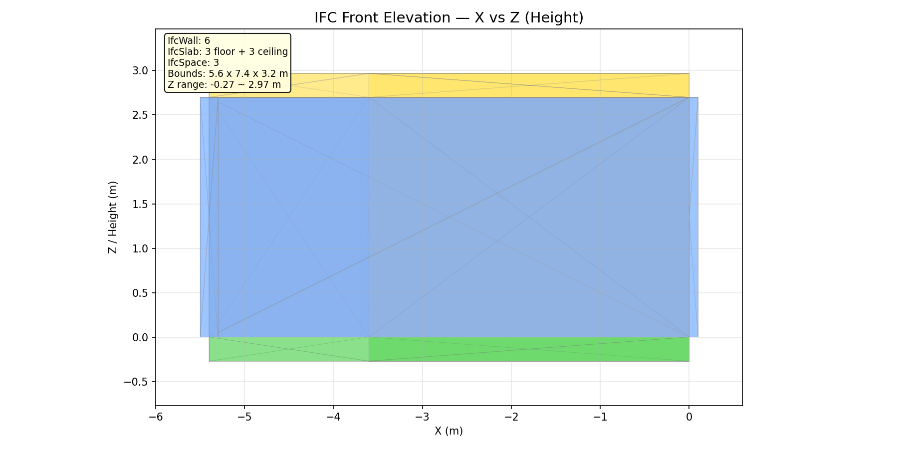
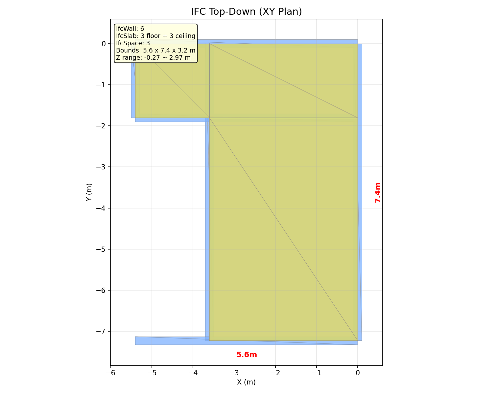

# GSS — 3D Gaussian Splatting to BIM Pipeline

카메라 영상만으로 3D Gaussian Splatting → Surface → BIM(IFC) → Digital Twin(GLB/USD) 자동 변환.

## Pipelines

### 기존 (9-step)
```
Video → s01(Frames) → s02(COLMAP) → s03(gsplat 2DGS) → s04(Depth) → s05(TSDF) → s06(Planes) → s06b(Regularization) → s07(IFC) → s08(Mesh Export)
```

### PlanarGS (7-step, 권장)
```
Video → s01(Frames) → s02(COLMAP) → s03_planargs(PlanarGS) → s06(Planes) → s06b(Regularization) → s07(IFC) → s08(Mesh Export)
```

### Exterior (10-step, 외부 건물)
```
Video → ... → s06(Planes) → s06c(Building Extraction) → s06b(Regularization) → s07(IFC) → s08(Mesh Export)
```

### Import (5-step, 기존 3DGS PLY 직접 투입)
```
s00(Import PLY) → s06(Planes) → s06b(Regularization) → s07(IFC) → s08(Mesh Export)
```

## Quick Start

```bash
pip install -e .
gss info                                          # Show pipeline steps
gss run                                           # Run 기존 pipeline
gss run --config configs/pipeline_planargs.yaml   # Run PlanarGS pipeline
gss run --config configs/pipeline_import.yaml     # Run Import pipeline
gss run-step plane_extraction                     # Run single step
```

## Pipeline Steps

| # | Step | Description | Pipeline |
|---|------|-------------|----------|
| s00 | import_ply | 기존 3DGS PLY 직접 투입 | Import |
| s01 | extract_frames | 비디오에서 프레임 추출 (OpenCV) | 기존/PlanarGS/Exterior |
| s02 | colmap | SfM 카메라 포즈 추정 (pycolmap) | 기존/PlanarGS/Exterior |
| s03 | gaussian_splatting | 2DGS 학습 (gsplat) | 기존 |
| s03_planargs | planargs | PlanarGS subprocess (NeurIPS 2025) | PlanarGS |
| s04 | depth_render | Depth/Normal 맵 렌더링 (gsplat) | 기존 |
| s05 | tsdf_fusion | TSDF 볼륨 통합 (Open3D) | 기존 |
| s06 | plane_extraction | RANSAC 평면 추출 + Manhattan 정렬 + 경계 | all |
| s06c | building_extraction | 외부 건물 재구성 (ground/facade/footprint/roof) | Exterior |
| s06b | plane_regularization | 기하 정규화 (normal snap, height snap, wall thickness, space detection) | all |
| s07 | ifc_export | IFC4 BIM 파일 생성 (IfcOpenShell) | all |
| s08 | mesh_export | IFC → GLB/USD 디지털트윈 내보내기 (trimesh, usd-core) | all |

## IFC Hierarchy (s07)

```
IfcProject → IfcSite → IfcBuilding → IfcBuildingStorey
  ├─ IfcWall (center_line_2d → IfcArbitraryClosedProfileDef polyline)
  │   └─ IfcRelVoidsElement → IfcOpeningElement
  │        └─ IfcRelFillsElement → IfcDoor / IfcWindow
  ├─ IfcColumn (round: IfcCircleProfileDef / rectangular: IfcRectangleProfileDef)
  ├─ IfcSlab (floor + ceiling, extruded boundary_2d)
  ├─ IfcRoof (flat/gable/hip, with ridge/eave annotations)
  └─ IfcSpace (room polygons from boundary_2d)
```

## Mesh Export (s08)

IFC → GLB (trimesh) + USDC (usd-core) + optional USDZ

| Format | Engine | Transform |
|--------|--------|-----------|
| GLB | trimesh | Z-up → Y-up: `(x,y,z)→(x,z,-y)` |
| USDC | usd-core | UsdGeom.Mesh + UsdPreviewSurface PBR |
| USDZ | usd-core | Packaged USD (Apple Vision Pro / ARKit) |

## s06b Plane Regularization

| Phase | Module | Description |
|-------|--------|-------------|
| A | `_snap_normals` | Wall normals → Manhattan axes (or cluster mode for oblique) |
| B | `_snap_heights` | Floor/ceiling height clustering + storey detection |
| C | `_wall_thickness` | Parallel pair detection + center-lines |
| C2 | `_wall_closure` | Synthesize missing walls (AABB/convex/concave hull) |
| D | `_intersection_trimming` | Snap wall endpoints to corners |
| E | `_space_detection` | Polygonize center-lines → room boundaries |
| F | `_opening_detection` | Door/window detection via Cloud2BIM histogram (disabled by default) |
| G | `_exterior_classification` | Convex hull → interior/exterior wall classification |

## s06c Building Extraction (Exterior)

| Phase | Module | Description |
|-------|--------|-------------|
| A | `_ground_separation` | 가장 넓은 수평면 → ground label |
| B | `_building_segmentation` | DBSCAN density clustering (optional) |
| C | `_facade_detection` | Normal-grouped vertical plane clusters → facades |
| D | `_footprint_extraction` | Alpha shape / concave hull → 2D building outline |
| E | `_roof_structuring` | Plane intersection → ridge/eave/valley lines |
| F | `_storey_detection` | Height histogram → floor levels (optional) |

## Tech Stack

| Phase | Tool | Package |
|-------|------|---------|
| SfM | COLMAP + hloc | pycolmap |
| 3DGS (기존) | gsplat 2DGS | gsplat |
| 3DGS (PlanarGS) | PlanarGS subprocess | diff-plane-rasterization |
| TSDF | Open3D ScalableTSDFVolume | open3d |
| Planes | RANSAC + alphashape | open3d, alphashape, shapely |
| Regularization | normal/height snap, wall thickness, space detection | numpy, shapely |
| Building Extraction | ground/facade/footprint/roof | numpy, shapely, scipy |
| BIM | IfcOpenShell | ifcopenshell |
| GLB Export | trimesh | trimesh |
| USD Export | usd-core | pxr (UsdGeom, UsdShade) |

## Visualization

```bash
python scripts/visualize_planes_3d.py [--original] [--save]  # s06b planes/walls
python scripts/visualize_ifc.py [--save] [--open]             # IFC round-trip
python scripts/visualize_mesh.py <file> [--save] [--compare]  # GLB/USD export
```

| View | Image |
|------|-------|
| IFC Isometric |  |
| IFC Front |  |
| IFC Top-Down |  |

## Project Structure

```
src/gss/core/           - Pipeline runner, BaseStep ABC, shared contracts
src/gss/steps/s00~s08/  - Each step: __init__.py + step.py + config.py + contracts.py + README.md
src/gss/steps/s03_planargs/               - PlanarGS wrapper (replaces s03+s04+s05)
src/gss/steps/s06b_plane_regularization/  - Geometric cleanup (sub-modules A~G)
src/gss/steps/s06c_building_extraction/   - Exterior building reconstruction (sub-modules A~F)
src/gss/steps/s07_ifc_export/             - IFC builder modules (wall/slab/space/roof/column/opening/tessellation)
src/gss/steps/s08_mesh_export/            - IFC → GLB/USD export (_ifc_to_mesh, _glb_writer, _usd_writer)
src/gss/utils/          - Shared utilities (I/O, geometry, subprocess)
configs/                - YAML configs (4 pipeline configs + per-step)
data/                   - raw/ → interim/s00~s06c/ → processed/
scripts/                - Visualization, sample data download, full pipeline runner
tests/                  - 325 tests (pytest)
clone/PlanarGS/         - PlanarGS repo (separate conda env)
docs/                   - Research papers, images
```

## Testing

```bash
pytest tests/                    # Full suite (325 tests)
pytest tests/test_steps/ -v     # Step tests only
ruff check src/                  # Lint
```

## References

| 단계 | 논문 | 게재 | 역할 |
|------|------|------|------|
| 3DGS 기초 | [3D Gaussian Splatting](https://arxiv.org/abs/2308.04079) (Kerbl et al.) | SIGGRAPH 2023 | 3DGS 원본 |
| Surface (기존) | [2D Gaussian Splatting](https://arxiv.org/abs/2403.17888) (Huang et al.) | SIGGRAPH 2024 | 2DGS surfel 기반 surface reconstruction |
| Surface (PlanarGS) | [PlanarGS](https://arxiv.org/abs/2510.23930) | NeurIPS 2025 | GroundedSAM + co-planarity loss |
| 라이브러리 | [gsplat](https://arxiv.org/abs/2409.06765) (Ye et al.) | JMLR MLOSS | 2DGS 모드 내장 렌더링 라이브러리 |
| Plane→BIM | [Cloud2BIM](https://arxiv.org/abs/2503.11498) (Zbirovský, Nežerka) | Automation in Construction 2025 | RANSAC→boundary→IFC 파이프라인 검증 |
| BIM+3DGS | [Integrating CAD, BIM, and 3DGS](https://www.nature.com/articles/s41598-025-32244-y) | Nature Sci. Rep. 2026 | ISO 19650 준수, 3DGS as-built 검증 |
| Exterior | [GS4Buildings](https://arxiv.org/abs/2508.07355) | 2025 | LoD2 prior-guided building reconstruction |
| Digital Twin | [Material-informed GS](https://arxiv.org/abs/2511.20348) | 2025 | Camera → 3DGS → mesh → material → physics |

## License

MIT
